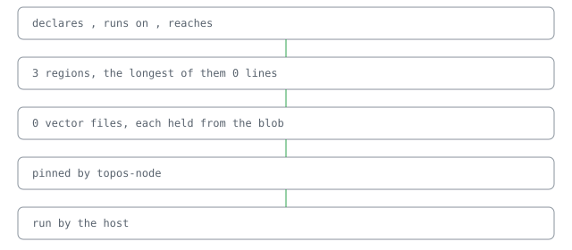

A world for a node package. Point it at the lines that name a package and it renders the manifest, the published manifest, and the build. [its regions, read off its own descriptor](docs/reference.md)

## Why the lines

A package is the lines that name it. Two manifests come from one lock, and the build is the compiler lines that lock holds.

## One package, two manifests

<p align="center"></p>

```bash
node examples/release/package.ts
```

It rests on topos.

## Check

● 0 cases hold

● `npm ci && npm run build`

## Pointers

- [Reference](docs/reference.md)
